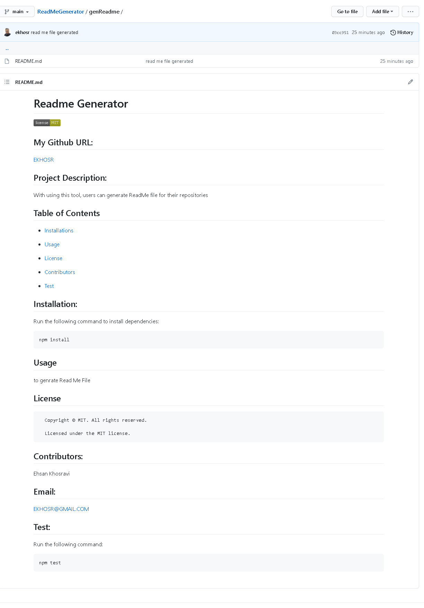

# ReadMeGenerator

```md
With using this tool, users can generate ReadMe file for their repositories.
```

### Demo Video:

[Watch it Here](https://drive.google.com/file/d/1NTDHleNS75AZoKTHTB8GoK8zX-JpXMzT/view?usp=sharing)

```sh
 https://drive.google.com/file/d/1NTDHleNS75AZoKTHTB8GoK8zX-JpXMzT/view?usp=sharing
```

## User Story

```md
AS A developer
I WANT a README generator
SO THAT I can quickly create a professional README for a new project
```

## Application Step-by-Step:

```md
- By answering the following qustions, a ReadMe.MD file will be generated for users:
- What's the Title of Your Project?
- Briefly Describe your project:
- Do You Want to Install Dependencies?
- What is the Usage of This Repo?
- Who Contributed to This Repo?
- What's the Command to Run Tests?
- What's the License of Your Project?
- What's Your Github Username?
- What's Your Email Address?
```

## Generated ReadMe file Sample:


